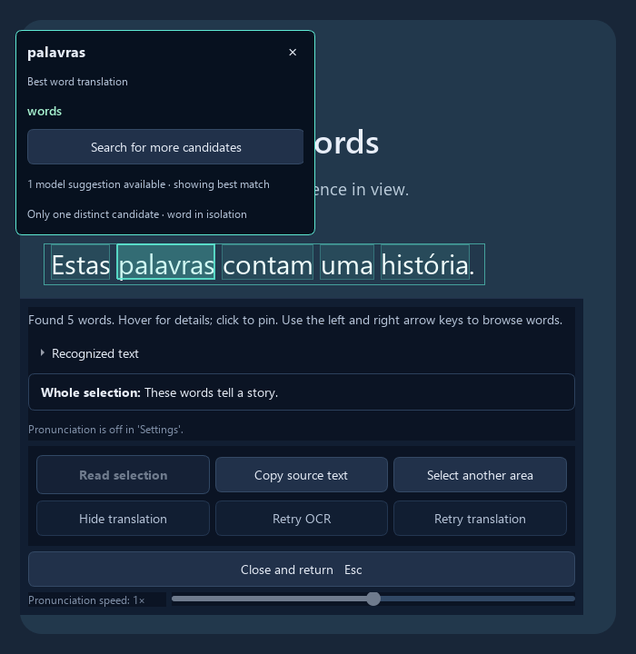

# Getting started

[Documentation](README.md) · [Troubleshooting](troubleshooting.md)

## Download and open

1. Open [GitHub Releases](https://github.com/AvDalfsen/LanguageLens/releases).
2. Download the **LanguageLens-…-windows-x64-preview.zip** asset. The checksum is available beside it; the “Source code” archives do not contain the portable app.
3. Extract the complete ZIP to a folder you can write to. Open **LanguageLens.exe**. Keep LanguageLensWorker.exe, LanguageLensUninstall.exe, and the _internal folder beside it.

The portable preview needs Windows x64; it does not need Python, Git, or administrator access. It is unsigned. Windows 10 22H2 has been exercised during development; Windows 11 is the intended primary target. Clean-machine validation remains pending.

## Choose the interface language

In the source app and next portable build, use **UI language** at the top right of Settings. All 25 choices are listed in their native names. The change takes effect immediately, works offline, and is saved automatically. It keeps your text language, translation target and voice settings. The longer help guides remain in English.

## Prepare your languages

In Settings, choose the language written on screen under **Text language**, and the language you want to read under **Translate into**.

Click **Download required files**. Lens downloads missing OCR/translation files, prepares sentence models and any needed word dictionary, then verifies them. Wait for **Ready to capture**. A translation model alone is not enough to enable capture.

Some language pairs need two models through English. Settings handles this automatically when both legs are available. Voices are separate optional downloads. Choosing a language does not start a download. See [language support](languages.md).

## Capture and explore

1. Click **Try a capture now** for a first attempt without enabling a global shortcut.
2. Drag around the text in the frozen screenshot.
3. Read the whole-selection translation below the selection. Hover over a word for suggestions, or click it to pin the popup. Left/right arrow keys browse the words.
4. Press **Escape**, or **Close and return**, to leave the screenshot.

For regular use, click **Start listening** in Settings. This enables **Capture hotkey**, F8 by default, and hides Settings to the tray. Press the shortcut from another application to capture.

**Lens does not pause the underlying app.** Pause a game yourself when needed. Desktop apps and borderless-windowed games are the most dependable; exclusive fullscreen and protected video can produce a black capture.

*Illustrated sample in the actual interface; example translations are supplied for the demonstration.*

## Add pronunciation

Turn on reading aloud in Settings, choose a voice, and click **Download voice**. Its size is shown before downloading. Use **Hear sample**, then capture text and choose **Read selection** or **Pronounce word**. This reads the original language. Nothing plays automatically.

The [pronunciation guide](pronunciation.md) explains speed, accents, optional notation, and voice terms.

## Settings and the tray

Preferences are saved automatically. **Pause listening** disables the shortcut so you can change it. **Start listening** enables it again. The shortcut is temporarily suspended while Settings or a screenshot owns the keyboard.

Closing Settings keeps Lens running. Reopen Settings from the tray icon, or choose **Quit** to exit. Opening Lens again shows the existing instance. **Help and about** opens the guides and installed version in the next build; v0.1.2 users can use this documentation directly.

## Update

Quit Lens from the tray, extract the new release into a complete new folder, and open its LanguageLens.exe. Do not mix files from different versions. Settings, downloaded models, voices, and packs are stored outside the portable folder.

Use **Check required files** under **Manage local files** if an update asks for verification. When moving from a Stanza-based build, check each language pair once to prepare its ONNX sentence models. Existing translation models, voices, and preferences are retained.

## Uninstall

Quit Lens, then open **LanguageLensUninstall.exe** from its portable folder. Confirm the cleanup of the app folder and Language Lens data. A separate confirmation covers shared Argos translation models; keep those if another Argos-based app uses them.

Deleting only the portable folder leaves downloaded data on disk. See [privacy and local files](privacy.md) for storage details.
